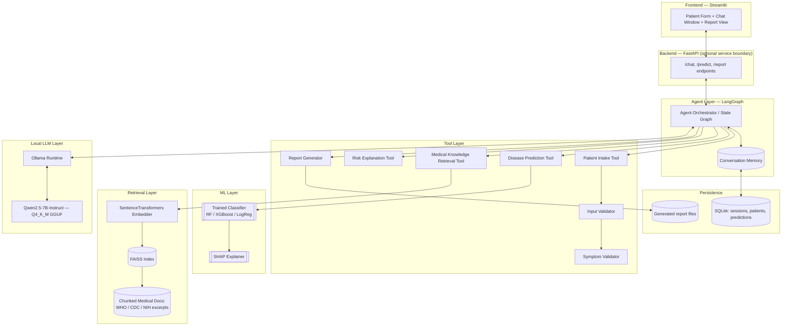
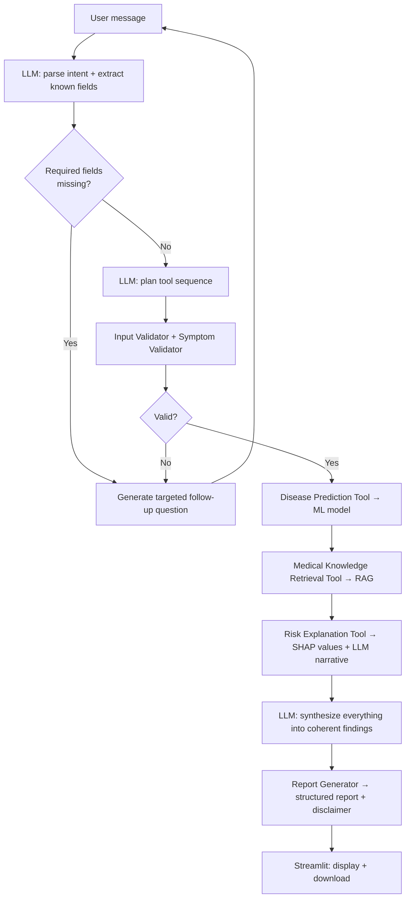

# MedAgent — Offline Agentic AI Clinical Decision Support System
### Project Specification & Architecture Document — v1.0 (Milestone 1 + 2 deliverable)

**Status:** DRAFT — awaiting approval before implementation begins.

---

## 0. Disclaimer (goes in every downstream artifact too)

MedAgent is an **educational capstone project**. It is not a certified medical device, is not validated for clinical use, and **must never be used to make real patient-care decisions**. Every generated report must carry this disclaimer visibly. This will be enforced in the Report Generator tool (Milestone 16), not left as a UI afterthought.

---

## 1. Objective

Build a fully offline, agentic clinical decision-support prototype that:

1. Converses with a user to collect patient data (with follow-up questions when info is missing).
2. Predicts disease risk using a **traditional ML classifier** (never the LLM).
3. Retrieves supporting medical evidence from a local, offline knowledge base (RAG).
4. Explains the prediction (SHAP + LLM narrative).
5. Produces a structured, citation-backed, disclaimer-bearing report.

Everything — LLM inference, embeddings, ML inference, vector search — runs locally on your RTX 4060 (8GB VRAM) / 16GB RAM / Ryzen 7 box, with zero paid APIs and zero required internet access after setup.

---

## 2. Scope Reality Check (read this before anything else)

Your spec asks for: a tuned/compared ML pipeline with SHAP, a full offline RAG stack, a LangGraph agent with memory and 7+ tools, a FastAPI backend, a Streamlit frontend, full test suites (unit + integration), and 8 categories of documentation (README, install guide, architecture diagrams, sequence diagrams, API docs, user manual, dev guide, final report, slides).

Each of those is individually reasonable for a capstone. All of them together, to "production quality," is a multi-person team's semester of work. This isn't a reason to cut corners — it's a reason to sequence things so that **you always have a working, demoable system**, and the scope you cut (if you must) is the *polish*, not the *core loop*.

So: I've kept your full 22-milestone ambition in this document (Section 8.2), but I've also defined a **hard MVP core** that must exist no matter what, and an explicit cut-list for a single-semester timeline (Section 8.3). Tell me your actual timeframe and I'll tell you honestly whether the full list is realistic.

**Hard MVP core (never cut):**
- One disease, one well-justified ML model, honestly evaluated (not cherry-picked metrics).
- A working agent loop: intake → validate → predict → retrieve evidence → explain → report.
- Everything runs offline, on your hardware, reproducibly (a `requirements.txt` + one setup script that actually works from clean).
- A report that a grader can generate end-to-end in front of you live.

Everything else (FastAPI as a separate service vs. Streamlit calling functions directly, multi-tool LangGraph vs. a simpler orchestration loop, SHAP vs. plain feature importances, 8 categories of docs vs. 3) is negotiable polish that we scale up or down based on your real deadline.

---

## 3. System Architecture

### 3.1 Component diagram



### 3.2 Layer-by-layer responsibilities

| Layer | Responsibility | Must NOT do |
|---|---|---|
| Frontend (Streamlit) | Collect input, render conversation, show prediction/probabilities/evidence/report, offer download | Contain business logic |
| Backend (FastAPI) | Stable API boundary between UI and agent; enables future non-Streamlit clients | Perform prediction or retrieval itself |
| Agent (LangGraph) | Orchestrate: decide what's missing, which tool to call next, when to stop | Predict disease risk (that's the ML model's job, never the LLM's) |
| Tools | Each does exactly one job, independently testable, pure-function style where possible | Depend on Streamlit or FastAPI internals |
| ML layer | Train/serve the classifier, compute SHAP values | Generate free text explanations (that's LLM + tool, using SHAP numbers as input) |
| RAG layer | Chunk, embed, index, retrieve, return passages **with source citations** | Fabricate sources; if nothing relevant is retrieved, tool must say so |
| LLM layer | Reasoning, planning, follow-up question generation, narrative synthesis, report prose | Disease prediction, arithmetic on probabilities (compute those in code, hand LLM the numbers) |
| Persistence | Store session state, patient inputs, predictions, generated reports | — |

This separation (LLM never predicts, ML never talks) is a design decision you should **highlight explicitly in your final report** — it's the kind of thing evaluators ask about, and it's also just correct ML engineering practice: it keeps your accuracy metrics attributable to a model you can actually validate (an LLM's "vibes-based" risk guess is not auditable; a Random Forest's is).

---

## 4. Agent Reasoning Workflow



Key point for your architecture write-up: the loop from D back to A is what makes this "agentic" rather than a fixed pipeline — the graph has a genuine branch/cycle, not just sequential chaining. This is also exactly why LangGraph (explicit state graph, supports cycles) is the right orchestration choice over plain LangChain chains (Section 5.1).

---

## 5. Technology Stack — Decisions & Justification

### 5.1 Orchestration: LangGraph vs. LangChain

| | LangGraph | Plain LangChain chains |
|---|---|---|
| Cycles (e.g., "ask follow-up, then re-enter the loop") | Native (it's a graph) | Awkward — chains are DAGs, you'd hand-roll a `while` loop around a chain anyway |
| Explicit state object across turns | Yes, first-class | Bolted on via memory objects |
| Debuggability for a report ("here is our state machine") | Very report-friendly — you can literally draw the graph | Less so |
| Learning curve | Slightly steeper | Gentler |

**Decision:** LangGraph as primary orchestrator. LangChain's document loaders/text splitters are still fine to use for the RAG ingestion side — no conflict there.

### 5.2 Local LLM runtime: Ollama vs. llama.cpp vs. vLLM

| | Ollama | llama.cpp (raw) | vLLM |
|---|---|---|---|
| Setup time | Minutes | Hours (build flags, GGUF handling by hand) | Complex; historically weaker Windows/consumer-GPU story |
| Model management | Built-in pull/list/rm | Manual | Manual |
| Fit for single-user desktop demo | Great | Overkill control for little benefit here | Wrong tool — vLLM is built for concurrent multi-request serving, not a single clinician's laptop session |
| What it's built on | Uses GGUF/llama.cpp under the hood | — | — |

**Decision:** Ollama. Mention in your report that Ollama wraps llama.cpp, so you're not skipping "real" local inference engineering — you're choosing the right abstraction level for a single-user app.

### 5.3 LLM model choice — **recommendation pending your approval**

VRAM budget on an 8GB card:

| Model | Quant | Approx. VRAM | Reasoning quality (for structured clinical-style tasks) |
|---|---|---|---|
| **Qwen2.5-7B-Instruct** | Q4_K_M | ~4.4–4.7 GB | Strong instruction-following, good at structured output (JSON follow-up questions, report sections) |
| Llama 3.1 8B Instruct | Q4_K_M | ~4.9 GB | Comparable quality, slightly larger footprint |
| Phi-3-mini (3.8B) | Q4 | ~2.3 GB | Faster, weaker at multi-step structured reasoning |
| Gemma 3 4B | Q4 | ~2.5–3 GB | Good lightweight fallback |

**Decision:** Qwen2.5-7B-Instruct via Ollama as primary, with model name in a config file (not hardcoded) so you can drop to Gemma 3 4B or Phi-3-mini as a "lite mode" if VRAM contention with the embedding model becomes an issue during concurrent use. This also gives you a legitimate "we designed for swappability" point for the report.

### 5.4 Vector store: FAISS vs. Chroma

Your stack already specifies FAISS, and it's the right call: no separate server process, minimal dependencies, very well documented, and sufficient for a knowledge base of the size you'll realistically build (dozens to low hundreds of chunked documents, not millions). Chroma is easier to use but adds a persistence-server layer you don't need. **Decision: FAISS**, flat or IVF index depending on corpus size (flat is fine below ~50k chunks).

### 5.5 Embedding model

**Decision:** `all-MiniLM-L6-v2` (sentence-transformers) — ~80MB, runs comfortably on CPU. Running it on CPU rather than GPU is deliberate: it frees your entire 8GB VRAM budget for the LLM and avoids the two local models fighting over the same GPU memory pool.

### 5.6 ML algorithms

Random Forest, XGBoost, Logistic Regression, Decision Tree — trained and compared as your spec requires, with cross-validation and hyperparameter tuning (GridSearchCV or Optuna). Final model selection justified by a metric appropriate to a clinical screening context — **recall/sensitivity and ROC-AUC weighted at least as heavily as raw accuracy**, since missing a positive case is the costlier error type. This is a legitimate methodological point for your report, not just a formality.

### 5.7 Backend/Frontend

FastAPI as a genuine service boundary (not just decorative) is worth keeping **if your timeline allows it** — it's a real, defensible software-engineering decision ("agent logic is UI-agnostic, could serve a mobile client tomorrow"). If timeline is tight, Streamlit can call the agent module directly and you drop FastAPI to a documented "future work" item rather than building it half-heartedly. Decide this in Section 8.3.

---

## 6. Disease & Dataset Selection — recommendation pending Milestone 5

**Recommendation: Heart Disease** (UCI Cleveland dataset, or the cleaned Kaggle "Heart Disease" derivative).

Why, relative to your listed alternatives:
- 13–14 well-understood clinical features (age, cholesterol, resting BP, max heart rate, ST depression, etc.) — good for feature-importance and SHAP storytelling.
- Extremely well precedented in ML literature, so your methodology section can cite comparable published baselines (useful for a capstone report's related-work section).
- Small enough to train fast on your hardware (seconds to low minutes even with cross-validation + hyperparameter search), leaving your compute budget for the LLM/RAG side.
- Binary classification keeps ROC/PR curve and confusion matrix interpretation clean for a first pass.

Diabetes (Pima Indians) is a reasonable second choice but has known data-quality issues (implausible zero values in several columns) that would force you to spend report space justifying imputation choices rather than agent architecture. Stroke and Kidney Disease datasets tend to be more class-imbalanced, which is a fine advanced topic but adds complexity you may not want on top of everything else here.

This is a recommendation, not a lock-in — we finalize it formally in Milestone 5 with an actual dataset audit (size, licensing, missingness, class balance).

---

## 7. Repository Structure

```
medagent/
├── README.md
├── requirements.txt
├── .env.example
├── config/
│   ├── settings.yaml          # model names, paths, thresholds — no hardcoded values in code
│   └── logging.yaml
├── data/
│   ├── raw/                   # original dataset, untouched
│   ├── processed/             # cleaned/split data
│   └── knowledge_base/        # source docs for RAG (WHO/CDC/NIH excerpts, licensing notes)
├── embeddings/
│   └── faiss_index/           # persisted FAISS index + metadata store
├── ml/
│   ├── training/
│   │   ├── train.py
│   │   ├── preprocessing.py
│   │   └── hyperparameter_search.py
│   ├── evaluation/
│   │   ├── metrics.py
│   │   └── shap_analysis.py
│   └── models/                # serialized trained models (.joblib)
├── agent/
│   ├── graph.py                # LangGraph state graph definition
│   ├── state.py                # typed conversation/session state
│   └── prompts/                # prompt templates, versioned
├── tools/
│   ├── patient_intake.py
│   ├── input_validator.py
│   ├── symptom_validator.py
│   ├── disease_prediction.py
│   ├── knowledge_retrieval.py
│   ├── risk_explanation.py
│   └── report_generator.py
├── backend/
│   ├── main.py                 # FastAPI app (if in scope — see 5.7/8.3)
│   └── routes/
├── frontend/
│   └── streamlit_app.py
├── database/
│   ├── models.py                # SQLite schema (SQLAlchemy or raw)
│   └── session_store.py
├── tests/
│   ├── unit/
│   └── integration/
├── docs/
│   ├── architecture.md
│   ├── installation.md
│   ├── user_manual.md
│   ├── developer_guide.md
│   └── final_report/           # LaTeX or Word source for the capstone report
├── outputs/
│   └── reports/                 # generated patient reports (gitignored except .gitkeep)
└── scripts/
    ├── setup_env.sh
    └── download_models.sh       # pulls Ollama model, downloads embedding model weights
```

---

## 8. Development Roadmap

### 8.1 Consolidating your 22 micro-milestones into 8 phases

Your original list is good *content*, just too fine-grained to schedule against a real calendar. I've grouped it:

| Phase | Covers your milestones | Deliverable |
|---|---|---|
| **P0 — Foundations** | 1, 2, 3, 4 | This document (approved) + working dev environment + empty-but-runnable repo skeleton |
| **P1 — ML Core** | 5, 6, 7, 8 | Trained, evaluated, justified classifier with saved model artifact |
| **P2 — Knowledge Base** | 9, 10, 11 | Chunked docs → embeddings → queryable FAISS index with a standalone test script |
| **P3 — Local LLM** | 12 | Ollama running Qwen2.5-7B locally, verified latency/VRAM budget |
| **P4 — Agent Core** | 13, 14, 15 | LangGraph agent with all 7 tools wired in, conversation memory working end-to-end |
| **P5 — Reporting** | 16 | Structured report generator (disclaimer, prediction, SHAP, evidence, citations) |
| **P6 — Interfaces** | 17, 18 | Streamlit UI (+ FastAPI if in scope) |
| **P7 — Hardening** | 19, 20, 21, 22 | Tests, performance tuning, full documentation set, final polish |

### 8.2 If you have a two-semester / ~24-week runway

| Phase | Weeks |
|---|---|
| P0 | 1–2 |
| P1 | 3–5 |
| P2 | 6–7 |
| P3 | 8 |
| P4 | 9–13 |
| P5 | 14–15 |
| P6 | 16–19 |
| P7 | 20–24 |

Full scope as originally written is realistic here, including FastAPI, SHAP, and the full documentation suite.

### 8.3 If you have one semester / ~13-week runway — MVP cutline

Keep P0–P5 essentially as-is (that's your defensible core), but cut like this:

- **Drop FastAPI as a separate service.** Streamlit calls the agent module directly. Document the FastAPI boundary as "designed for, not built" — still a legitimate architecture talking point.
- **Simplify tools from 7 to 4**: merge Input Validator + Symptom Validator into one Validation Tool; keep Intake, Prediction, Retrieval, Explanation, Report as the rest.
- **RAG corpus stays small and single-topic** (your one chosen disease only) rather than a broad multi-disease knowledge base.
- **Testing**: unit tests on every tool (non-negotiable, they're small and fast to write), integration test on the full happy-path loop; skip building out a large manual QA matrix.
- **Documentation**: README + architecture doc + user manual + final report are mandatory; API docs and a separate developer guide can be merged into the architecture doc.

| Phase | Weeks |
|---|---|
| P0 | 1 |
| P1 | 2–3 |
| P2 | 4 |
| P3 | 5 |
| P4 | 6–9 |
| P5 | 10 |
| P6 | 11–12 |
| P7 | 13 |

**Tell me which of 8.2/8.3 (or something else) is your real timeline and I'll adjust everything downstream to match** — this changes how hard we push on FastAPI and the doc suite specifically.

### 8.4 Definition-of-Done template (apply at every milestone)

- [ ] Objective and theory explained before code was written
- [ ] Code has type hints + docstrings
- [ ] Module is independently testable (unit test exists and passes)
- [ ] No hardcoded paths/model names — pulled from `config/settings.yaml`
- [ ] Logged (not `print`-debugged)
- [ ] You can explain, out loud, why this design over the alternatives

---

## 9. Hardware & Performance Budget

| Component | Approx. VRAM/RAM | Notes |
|---|---|---|
| Qwen2.5-7B-Instruct (Q4_K_M) | ~4.5 GB VRAM | Leaves ~3.5 GB headroom on the 4060 |
| Embedding model (MiniLM-L6-v2) | ~80 MB, CPU-only | Deliberately kept off GPU |
| ML model (RF/XGBoost) inference | Negligible, CPU | Training itself: seconds–minutes on this dataset size |
| OS + Streamlit + misc | ~1–1.5 GB VRAM/RAM overhead | |

This leaves comfortable headroom for a growing context window during a longer conversation. If you later add a second concurrent model (e.g. a reranker), revisit this budget explicitly rather than assuming it'll fit.

**Verified on real hardware (Windows 11, RTX 4060, 2026-07-27)**: measured
4.7 GB VRAM, 100% GPU, ~50 tokens/second — matches this table's prediction
closely. Full results and one prompt-correctness finding in
`docs/llm_verification_findings.md`. Note the measurement was taken at
Ollama's default 4096-token context; re-verify if P4 needs a larger
context window, since VRAM grows with it.

---

## 10. Risks & Mitigations

| Risk | Mitigation |
|---|---|
| VRAM contention if embeddings run on GPU alongside the LLM | Keep embeddings on CPU (Section 5.5) |
| Medical source licensing/redistribution issues in `data/knowledge_base/` | Only store excerpts you have rights to redistribute in your repo; document source + retrieval date for each; prefer official WHO/CDC/NIH public fact sheets over copyrighted textbook scans |
| Dataset class imbalance or leakage | Explicit stratified splits, checked in P1 before any tuning starts |
| Scope creep across 22 milestones | Phase gating (8.1) — no starting phase N+1 tools before phase N ML/RAG core is actually working end-to-end |
| LLM "hallucinating" a prediction instead of calling the ML tool | Enforce via prompt + tool-calling schema: the LLM is never given raw patient data alongside a request to also state a risk number; it only ever sees the ML tool's output to narrate |

---

## 11. Testing Strategy Overview

- **Unit tests**: one per tool, one per ML pipeline stage (preprocessing, training, evaluation), one per RAG stage (chunking, embedding, retrieval).
- **Integration tests**: full agent loop on 2–3 scripted patient scenarios (including one that triggers a follow-up question, one with clean input).
- **Manual QA checklist**: a markdown checklist in `docs/` for things automation won't catch well (report readability, disclaimer visibility, UI responsiveness).

---

## 12. Common Mistakes to Avoid at This Stage

- Starting the LangGraph agent before the ML model and RAG index actually exist and are tested standalone — you'll end up debugging three unfinished systems at once.
- Letting the LLM see raw feature values and asked to "estimate risk" anywhere, even in a dev/debug prompt — it'll bleed into your final demo if you're not disciplined about it from day one.
- Treating SHAP as a checkbox — pick 2–3 features per prediction to narrate meaningfully rather than dumping the full SHAP output into the report.
- Writing the final report at the end instead of incrementally — every phase in Section 8 should end with report-ready paragraphs, not just working code.

---

## 13. Next Milestone / Approval Checkpoint

Before I write any implementation code, I need from you:

1. Confirm or revise: **Qwen2.5-7B-Instruct**, **FAISS**, **all-MiniLM-L6-v2**, **Heart Disease dataset** as the four load-bearing choices above.
2. Your actual timeframe — Section 8.2 (full scope, ~24 weeks) vs. 8.3 (MVP cutline, ~13 weeks) vs. something else.
3. Whether FastAPI stays in scope as a real service boundary, or is deferred to "designed for, not built."

Once you approve/adjust this document, Milestone 1 formally closes and we move to **Milestone 5-equivalent (P1): dataset audit and preprocessing plan** for Heart Disease — theory first (why stratified split, why these preprocessing choices), then code.
